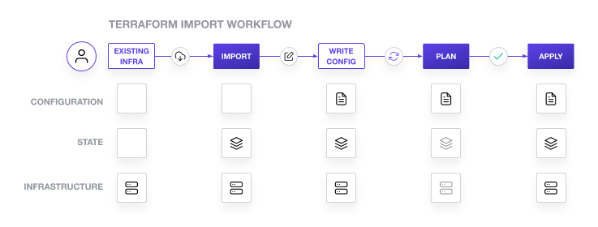

# Introduction to Terraform Import and Refactoring - Why It Matters

## Overview

This blog post marks the first in our series about using **Terraform Import** and **Refactoring** techniques to bridge the gap between manual infrastructure management and **Infrastructure-as-Code (IaC)** best practices. We will explore how **Terraform Import** helps organizations manage Day 2 operations and address real-world challenges, such as configuration drift, brownfield deployments, and the fear of modifying existing infrastructure code.

In the coming posts, we’ll cover **step-by-step instructions** and **practical examples** on how to successfully import and refactor Terraform-managed infrastructure, ensuring smoother operations and enhanced scalability.

---

## Table of Contents

1. [Why Day 2 Operations Matter](#why-day-2-operations-matter)
2. [Challenges in Day 2 Operations](#challenges-in-day-2-operations)
    - 2.1 [Terraform for Day 1 Provisioning](#terraform-for-day-1-provisioning)
    - 2.2 [Brownfield Deployments](#brownfield-deployments)
    - 2.3 [Configuration Drift and Stale Workflows](#configuration-drift-and-stale-workflows)
    - 2.4 [Fear of Modifying Terraform Configurations](#fear-of-modifying-terraform-configurations)
3. [How Terraform Import Solves These Challenges](#how-terraform-import-solves-these-challenges)
    - 3.1 [Managing Manual Changes](#managing-manual-changes)
    - 3.2 [Integrating Brownfield Deployments](#integrating-brownfield-deployments)
    - 3.3 [Addressing Configuration Drift](#addressing-configuration-drift)
    - 3.4 [Reducing Risk and Building Confidence](#reducing-risk-and-building-confidence)
4. [Practical Example Workflow: Resolving Drift with Terraform Import](#practical-example-workflow-resolving-drift-with-terraform-import)
5. [What's Coming Next in the Series](#whats-coming-next-in-the-series)

---

## Why Day 2 Operations Matter

While **Day 1 provisioning** of infrastructure using tools like **Terraform** is usually straightforward, **Day 2 operations**—which involve ongoing management, updates, and maintenance of resources—are often fraught with challenges. 

Many organizations face difficulties in keeping their infrastructure in sync with their Terraform code, especially when manual operations take over after initial provisioning. This disconnect can lead to **configuration drift**, inconsistent environments, and costly errors when changes need to be made.


---
## Real-World Challenges in Day 2 Operations

### 1. Terraform Used Only for Day 1 Provisioning
In many organizations, Terraform is used exclusively for Day 1 provisioning, with subsequent changes managed manually. This approach creates challenges like:
- **Manual Changes**: Resources are modified directly through cloud consoles or CLI, bypassing Terraform workflows.
- **Drift from IaC**: Terraform configurations quickly become out of sync with actual infrastructure, making updates risky.

**Example Scenario**:  
An organization has two environments—`prod` and `dev`—with Terraform-managed root module repositories tied to dedicated workspaces. While Day 1 provisioning follows GitOps principles, all Day 2 operations, such as scaling or modifying infrastructure, are performed manually. Over time, discrepancies between the live environment and Terraform configurations make it impossible to safely run `terraform apply`.

---

### 2. Brownfield Deployments and Hybrid Environments
Organizations often inherit existing infrastructure due to migrations, acquisitions, or legacy systems. These "brownfield" resources are not initially IaC-managed, leading to:
- **Untracked Resources**: Existing infrastructure is not represented in Terraform state or configurations.
- **Integration Challenges**: Migrating unmanaged resources into Terraform requires careful planning to avoid disruptions.

**Example Scenario**:  
During an on-premises to AWS migration, a fleet of EC2 instances and RDS databases is provisioned manually to ensure continuity. Terraform is later adopted for new deployments, but the previously created resources remain unmanaged, causing fragmentation and compliance challenges.

---

### 3. Configuration Drift and Stale Workflows
Manual operations introduce drift between the live environment and Terraform's state or configuration files:
- **Stale Terraform State**: Resources created or modified manually are missing from Terraform's view.
- **Operational Risks**: Running `terraform apply` may inadvertently overwrite manual changes or cause resource destruction.
- **Bloated Codebases**: Repositories become cluttered with unused or inaccurate configurations.

**Example Scenario**:  
A team adopts Terraform for AWS infrastructure management. Over time, new resources, such as S3 buckets and Lambda functions, are added manually due to time constraints. The stale Terraform repository fails to reflect the true state of the environment, eroding trust in IaC workflows.

---

### 4. Fear of Modifying Terraform Configurations
Teams often hesitate to modify Terraform configurations for fear of:
- **Production Outages**: Incorrect configurations or state changes causing downtime.
- **Complex Codebases**: Large and undocumented Terraform repositories intimidating users.
- **Unfamiliarity with Terraform**: Operations teams defaulting to manual workflows due to limited IaC expertise.

**Example Scenario**:  
A production environment contains critical resources, but the Terraform codebase hasn't been updated in months. The team avoids touching Terraform configurations, relying instead on manual changes, further exacerbating drift and stale state.

---

## How Terraform Import Solves These Challenges

### Managing Manual Changes

- **Terraform Import** allows teams to bring unmanaged resources into the Terraform state, effectively "reclaiming" them under IaC management.
- This reduces drift and ensures that all resources, whether provisioned manually or by Terraform, are tracked and managed from a central codebase.

### Integrating Brownfield Deployments

- Terraform Import enables teams to import legacy infrastructure and migrate it into their IaC workflows without disruption.
- This is especially useful for transitioning from manual management to Terraform-driven workflows in hybrid or multi-cloud environments.

### Addressing Configuration Drift

- By importing resources that were previously unmanaged, teams can synchronize their Terraform configurations with actual infrastructure.
- Tools like `terraform refresh` and `terraform plan` help ensure that Terraform’s view of the infrastructure is accurate.

### Reducing Risk and Building Confidence

- Terraform Import reduces the risk of introducing errors by allowing teams to manage manual workflows carefully and incrementally, ensuring that existing infrastructure is safely brought under IaC management.

---

## Standard Example Workflow: Resolving Drift with Terraform Import




### 1. **Identify Drift**
   - Inspect live infrastructure (e.g., AWS Management Console, Azure Portal) and compare it with the Terraform state to identify unmanaged or drifted resources.  
   - Use tools like AWS CLI, Azure CLI, or any custom scripts to list unmanaged resources.

---

### 2. **Import Resources**
   - Import resources to Terraform state using one of the following approaches:

#### **Using `terraform import`:**
   - Manually add unmanaged resources to the state:
     ```bash
     terraform import aws_instance.example i-0abcd1234efgh5678
     ```
   - Once imported, update the Terraform configuration manually to reflect the resource.

#### **Using Terraform Config-Driven Import:**
   - Utilize the `import` block in Terraform configuration to simplify the import process. Add the following block to your `main.tf` file:
     ```hcl
     terraform {
       required_version = ">= 1.5"
     }

     import {
       to = aws_ec2.bar
       id = "foo"
     }
     ```
   - Execute the import process with:
     ```bash
     terraform plan
     terraform apply
     ```
   - Terraform will generate the configuration automatically if supported, or provide details to complete it manually.

#### **Using Terraformer:**
   - Use [Terraformer](https://github.com/GoogleCloudPlatform/terraformer) to automate the import and configuration generation process:
     ```bash
     terraformer import aws --resources=ec2,s3 --connect=true --profile=default --regions=us-west-2
     ```
   - This tool will generate HCL configurations and state files for specified resources. Review and validate the generated configurations before applying.

---

### 3. **Refresh and Validate**
   - Refresh Terraform’s state to align it with the current live infrastructure:
     ```bash
     terraform refresh
     ```
   - Validate the configuration to ensure consistency:
     ```bash
     terraform validate
     ```

---

### 4. **Update Configurations**
   - If using `terraform import`, manually write or update the Terraform configuration file for the imported resource.  
   - For config-driven imports, ensure the generated or existing configuration matches the desired state.

---

### 5. **Reconcile and Apply**
   - Review the planned changes:
     ```bash
     terraform plan
     ```
   - Apply the configuration to bring the infrastructure under full Terraform management:
     ```bash
     terraform apply
     ```
   - Confirm that the resource is now managed by Terraform without drift.

---

### Summary of Import Methods
| **Method**              | **Use Case**                                                                 |
|--------------------------|-----------------------------------------------------------------------------|
| `terraform import`       | Manual and straightforward for individual resources.                        |
| Config-Driven Import     | Simplifies imports and allows automated plan and apply directly in HCL.     |
| Terraformer              | Ideal for bulk imports and generating HCL configurations for multiple resources. |


---

## What's Coming Next in the Series

In the following posts, we will dive deeper into the practical aspects of using **Terraform Import** to resolve common challenges in Day 2 operations:

- **Post 2**: Getting Started with Terraform Import
- **Post 3**: Practical Example of Importing AWS EC2 Instances
- **Post 4**: Refactoring Terraform Code for Scalability
- **Post 5**: Transitioning from `count` to `for_each` Logic
- **Post 6**: State Management Best Practices
- **Post 7**: Advanced Techniques for Complex Imports
- **Post 8** Final Thoughts and Best Practices

Stay tuned as we continue to explore the power of **Terraform Import** in managing cloud infrastructure at scale!

---

## Conclusion

In this post, we introduced the key challenges of Day 2 operations and discussed how **Terraform Import** can help organizations bridge the gap between manual infrastructure management and Infrastructure-as-Code practices. By leveraging Terraform Import, teams can regain control over their infrastructure, reduce risks, and ensure long-term consistency.

---

For any questions or feedback, feel free to reach out to us. We’re excited to continue this journey into efficient and scalable Terraform management with you!
