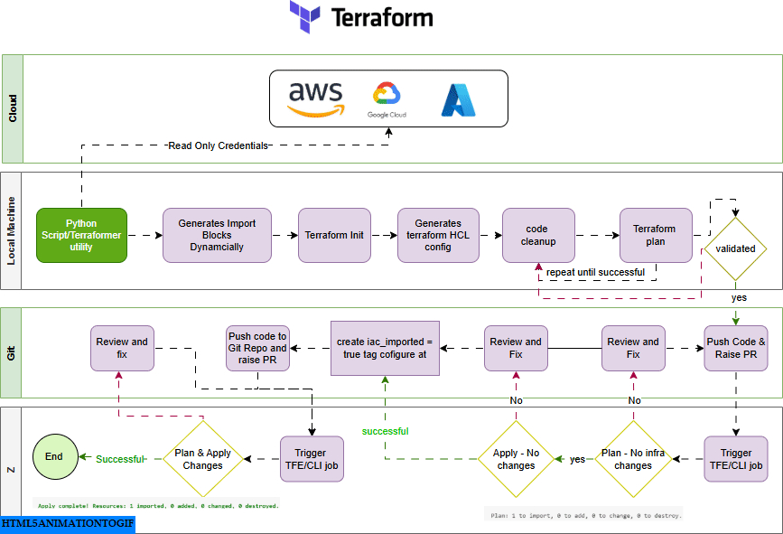

# ABC Corp’s IaC Evolution: Bringing Infrastructure Under Control:

### **Getting Started with Terraform Import**

Before diving into the details of Terraform Import and reafactoring, let's take a closer look at the **ABC Corp environment** to understand why importing and refactoring resources is necessary.

**Scenario Overview**:

ABC Corp has multiple environments (production and development), and their infrastructure is managed using Terraform. However, during their ongoing migration from on-premises systems to the cloud, certain resources were created manually or via the cloud console, outside of Terraform’s management. This creates the need to bring those resources under Terraform’s control to ensure they are properly managed going forward.

**Infrastructure Overview**:
- **Platform**: Terraform Cloud (or CLI for local management).
- **Environments**: Two environments, **prod** and **dev**, each with dedicated Terraform workspaces (`prod-abc-app`, `dev-abc-app`).
- **Repositories**:
  - **Root Module Repositories**: Contain environment-specific Terraform configurations.
  - **Module Repository**: Hosts reusable modules for AWS services (e.g., EC2, RDS, VPC).
  
**Day 1 Provisioning**: Infrastructure is provisioned through a GitOps workflow, using Terraform to ensure automated deployments.

### Current State of Operations
- **Day 2 Operations**:
  - Performed manually or through "click ops" (cloud console/CLI).
  - Resources created during ongoing on-premises migration are **not tracked** in Terraform.
- **Challenges**:
  - **Drift**: Manual changes lead to discrepancies between the live environment and Terraform state.
  - **Risk of Impact**: Teams avoid modifying Terraform configurations to prevent production issues.
  - **Stale Configurations**: Terraform codebases and workspaces are outdated, no longer reflecting the current infrastructure.

---
## Import Flow -Way forward
The following workflow outlines how ABC Corp systematically approached the import process to align their resources with Terraform, integrating automation and GitOps principles to maintain efficiency and reliability.



The Workflow operates across four layers:

1. **Cloud**: Read-only credentials fetch resource details from providers like AWS, Azure, or GCP.

2.  **Local Machine**: Scripts or tools generate import blocks, initialize Terraform, and create HCL configurations. The process includes validation and cleanup until successful.

3.  **Git**: Validated configurations are pushed to a repository. Pull requests are reviewed, fixes applied, and import tags added.

4.  **Terraform Enterprise/CLI**: Terraform jobs are triggered to plan and apply changes, ensuring resources are fully imported and managed by IaC.

---
### Prerequisites and Setup

Before using Terraform Import, ensure you have the following prerequisites and setup:

### 1. AWS Account Setup
1. Ensure you have an active AWS account.
2. Create Access Keys:
   - Go to **IAM > Users** in the AWS Console.
   - Select your user, navigate to **Security Credentials**, and generate an **Access Key ID** and **Secret Access Key**.
3. Configure AWS CLI:
   ```bash
   aws configure
   ```
**Provide**:
- AWS Access Key ID
- AWS Secret Access Key
- Default Region (e.g., - us-east-1)
- Output Format (default: json)

**Verify Setup**:
```bash
aws sts get-caller-identity
```

### 2. Install Visual Studio Code
- Download and install  [VS Code](https://code.visualstudio.com/)

- Install the [Terraform Extension ](https://marketplace.visualstudio.com/items?itemName=HashiCorp.terraform) for syntax highlighting and linting


### 3. Install AWS CLI
- Download AWS CLI from the [official guide](https://docs.aws.amazon.com/cli/latest/userguide/getting-started-install.html).

   **Verify installation**:
  ```bash
  aws --version
  ```

### 4. Install Python and Libraries
- Download Python 3.x from [python.org](https://www.python.org/).

**Verify installation**:
```bash
python --version
pip --version
```
**Install required libraries**:
```bash 
pip install boto3 loguru
```
### 5. Install Terraform
- Download Terraform from the [official website](https://developer.hashicorp.com/terraform/install).

**Verify installation**:
```bash
terraform --version
```
### 6. Git Repository Setup

Clone the repository:
```bash
git clone <repository-url>
cd <repository-folder>
```
- Use Git to manage Terraform configurations.

### 7. Workspace Setup
Using Terraform Cloud
1. Log in to Terraform Cloud.
2. Create a new Workspace:
    - Name the workspace based on your environment (e.g., prod-app-xyz).
    - Link your Git repository to the workspace for automated plan and apply workflows.

3. Configure main.tf with the remote backend
```hcl
terraform {
  backend "remote" {
    organization = "your-org-name"

    workspaces {
      name = "your-workspace-name"
    }
  }
}
```
### 7.1 Backend Configuration (Optional)
If using a remote backend like S3, configure main.tf as follows:

```hcl

terraform {
  backend "s3" {
    bucket         = "your-terraform-state-bucket"
    key            = "path/to/your/statefile"
    region         = "us-west-2"
    dynamodb_table = "terraform-lock-table"
  }
}
```
---

## What's Coming Next in the Series

In the following posts, we will dive deeper into the **Practical Example of Importing AWS EC2** Instances to see the step by step process to complete the import work.

- **Post 3**: Practical Example of Importing AWS EC2 Instances
- **Post 4**: Refactoring Terraform Code for Scalability
- **Post 5**: Transitioning from `count` to `for_each` Logic
- **Post 6**: State Management Best Practices
- **Post 7**: Advanced Techniques for Complex Imports
- **Post 8** Final Thoughts and Best Practices

Stay tuned as we continue to explore the power and versatility of **Terraform Import** in transforming cloud infrastructure management at scale!


---

## Conclusion
Managing infrastructure at scale is no small feat, but with tools like Terraform Import, teams like ABC Corp can gain control over their cloud environments and lay the groundwork for streamlined, automated workflows. From bringing unmanaged resources under IaC control to implementing scalable configurations and best practices, the journey to IaC maturity is both challenging and rewarding.

In the upcoming posts, I'll be diving deeper into the practical and advanced aspects of using Terraform Import, covering everything from step-by-step guides to best practices for managing large-scale cloud environments.

Let’s take this journey together and bring your infrastructure under control—efficiently, reliably, and at scale!

